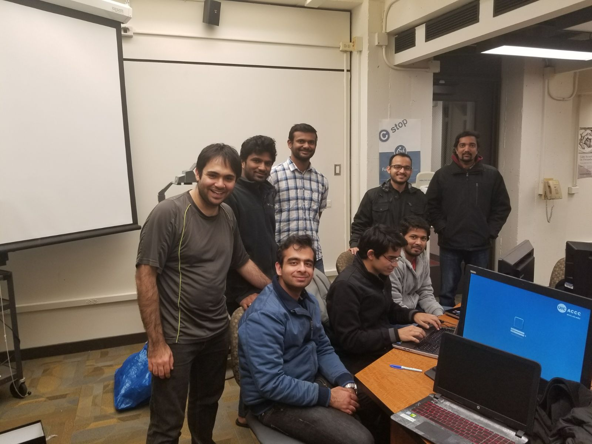

# CS 441: Engineering Distributed Objects For Cloud Computing Final Project [Fall 2017]

### Description: Create a Monte-Carlo simulator for evaluating stock purchase decisions that runs on Spark and deployed on your private OctoPi cloud.

# How to run
#### 1. Open terminal
#### 2. Change to docker file directory using `cd docker_cloud_final/`
#### 3. Check if a container of name `simulator` is already running by executing `docker ps`
#### 4. If a container is running then delete it using `docker rm simulator`
#### 5. Now, execute `docker build .`
#### 6. After the successful build, copy the build id (the random number in the last line)
#### 7. Now, execute `docker run --name simulator <the build id>` (it would be something like `docker run --name simulator a01a7738b573`)
#### 8. Now, wait for it to complete, it would take 15 mins to 30 mins for it to complete


#Hardware required
* Raspberry PIs [[Buy](https://www.amazon.com/Raspberry-Pi-RASPBERRYPI3-MODB-1GB-Model-Motherboard/dp/B01CD5VC92)]
* Power suppy [[Buy](https://www.amazon.com/CanaKit-Raspberry-Supply-Adapter-Charger/dp/B00MARDJZ4/ref=pd_bxgy_147_2?_encoding=UTF8&psc=1&refRID=6M8CYG5AKF2YM9H09JBN)]
* SD card [[Buy](https://www.amazon.com/Samsung-MicroSD-Adapter-MB-ME32GA-AM/dp/B06XWN9Q99/ref=pd_bxgy_147_3?_encoding=UTF8&psc=1&refRID=6M8CYG5AKF2YM9H09JBN)]

#Assumptions

#### We have 8 Raspberry PIs (1 Master, 7 Slaves).

## Kubernetes cluster setup on raspbian:

#### 1. [Install OS ](https://www.raspberrypi.org/documentation/installation/installing-images/) , use RASPBIAN STRETCH WITH DESKTOP
#### 2. Boot OS and connect to wifi 
#### 3. [Install vnc server on raspbian](https://www.raspberrypi.org/documentation/remote-access/vnc/)
#### 4. Install vnc viewer on your laptop [same as above]
#### 5. [Change hostname](https://www.cyberciti.biz/faq/ubuntu-change-hostname-command/)
#### 6. Follow k8s here [link](https://gist.github.com/alexellis/fdbc90de7691a1b9edb545c17da2d975), but after kubeadm init, forward ipTables [execute ```sudo iptables -P FORWARD ACCEPT``` on every node].
#### 7. If kube-dns is not working then possibly nodes are not yet ready or you did not install a network driver, check dns pod status using:
 ``` kubectl --namespace=kube-system describe pod <pod-name> ``` 
 #### you can get pod-name using: 
 ``` kubectl get pods --namespace=kube-system```


## STEPS

#### 1. Wifi connection, [(https://learn.adafruit.com/adafruits-raspberry-pi-lesson-3-network-setup/setting-up-wifi-with-occidentalis) ](https://learn.adafruit.com/adafruits-raspberry-pi-lesson-3-network-setup/setting-up-wifi-with-occidentalis)
#####  NOTE: Wifi Connection when connecting to Enterprise network like that of a university which needs username and password, see step 2 in here [(https://gist.github.com/chatchavan/3c58511e3d48f478b0c2)](https://gist.github.com/chatchavan/3c58511e3d48f478b0c2) 

#### 2. Change hostname [(https://www.howtogeek.com/167195/how-to-change-your-raspberry-pi-or-other-linux-devices-hostname/)](https://www.howtogeek.com/167195/how-to-change-your-raspberry-pi-or-other-linux-devices-hostname/)

#### 3. Create Swap partition as the Ram is less (only on worker nodes) [(https://www.centos.org/docs/5/html/5.2/Deployment_Guide/s2-swap-creating-file.html)]
(https://www.centos.org/docs/5/html/5.2/Deployment_Guide/s2-swap-creating-file.html)

#### 4. Pull base docker image of Ubuntu ARM [(https://hub.docker.com/r/armv7/armhf-ubuntu/)](https://hub.docker.com/r/armv7/armhf-ubuntu/)

#### 5. Open docker terminal and type
``` docker run -it -expose amr7/ubuntu:latest bash```

#### 6. Add apt-get
```apt install software-properties-common ```

#### 7. Install Java8 [http://www.webupd8.org/2012/09/install-oracle-java-8-in-ubuntu-via-ppa.html](http://www.webupd8.org/2012/09/install-oracle-java-8-in-ubuntu-via-ppa.html)

#### 8. Install nano
```apt install nano ```

#### 9. Install Open ssh client
```apt install openssh-client```

#### 10. Install Open ssh server
```
apt install openssh-server
```

#### 11. Start ssh server and enable password less ssh login for root
```
/etc/init.d/ssh start
ssh-keygen -t rsa -P ""
cat ~/.ssh/id_rsa.pub >> ~/.ssh/authorized_keys
ssh localhost 
```

#### 12. change hostname to master
```
nano /etc/hosts
ssh master 
```

#### 13. Install Hadoop [https://raspberrypicloud.wordpress.com/2013/04/25/getting-hadoop-to-run-on-the-raspberry-pi/](https://raspberrypicloud.wordpress.com/2013/04/25/getting-hadoop-to-run-on-the-raspberry-pi/)

#### 14. Install Hive [https://www.edureka.co/blog/apache-hive-installation-on-ubuntu](https://www.edureka.co/blog/apache-hive-installation-on-ubuntu)

#### 15. Install Spark [https://medium.com/@josemarcialportilla/installing-scala-and-spark-on-ubuntu-5665ee4b62b1](https://medium.com/@josemarcialportilla/installing-scala-and-spark-on-ubuntu-5665ee4b62b1)

#### 16. Install Scala [https://www.scala-lang.org/download/](https://www.scala-lang.org/download/)

#### 17. Copy Input and project Jar files to Raspberry Pi
```
pscp -r C:\Users\Ragha\Desktop\filesToCopy\MyMonte\input pirate@192.168.1.29:
l```

#### 18. Copy Input and project Jar files to Docker
```
docker cp input 1ba3e9b11390:/root/
```

#### 19. Start the Hdfs and Yarn services
```
cd /usr/local/hadoop/etc/hadoop/start-all.sh
```

#### 20. Start the Spark Daemons
```
spark/sbin/start-all.sh
```

#### 21. Copy input files to hdfa
```
hdfs dfs -put /root/input/* /user/root/Companies/
hdfs dfs -put /root/finance/* /user/root/Finance/
```

#### 22. submit the spark job
``` 
 spark-submit --class com.hortonworks.example.Main --master yarn --deploy-mode cluster 
 --jars spark/lib/datanucleus-api-jdo-3.2.6.jar,spark/lib/datanucleus-core-3.2.10.jar,spark/lib/datanucleus-rdbms-3.2.9.jar,spark/lib/spark-1.6.3-yarn-shuffle.jar 
 --name monte-carlo MyMonte/monte-carlo-var-1.0-SNAPSHOT.jar Companies/* Finance/* Output
```
 
#### 23. Output on the HDFS and copy
```
hdfs dfs -cat /usr/local/Output/
hdfs dfs -get Output/* /usr/local/Output/
``` 

#### Final Image 
```
docker pull raghavendrasomannavar/montecarlo:1.0.0
```

### Team members ###

* Sankul Rawat (srawat5@uic.edu)  [[LinkedIn profile](https://www.linkedin.com/in/sankulrawat/)]
* Harsh P Bajaj (hbajaj3@uic.edu) [[LinkedIn profile](https://www.linkedin.com/in/harshbajaj543/)]
* Muttavarapu Sreeharsha (msreeh2@uic.edu)  [[LinkedIn profile](https://www.linkedin.com/in/sreeharsha-m-8a020569/)]
* Raghavendra Somannavar (rsoman2@uic.edu) [[LinkedIn profile](https://www.linkedin.com/in/raghavendra-somannavar-a8583788/)]
* Harshit Pant  (hpant2@uic.edu)  [[LinkedIn profile](https://www.linkedin.com/in/harshit-pant-854468ba/)]
* Rushit Thakker  (rthakk6@uic.edu) [[LinkedIn profile](https://www.linkedin.com/in/rushit-thakker-7928a364/)]
* Jose George (jgeorg41@uic.edu) [[LinkedIn profile](https://www.linkedin.com/in/jose-george-90615885/)]
* Sai Sharan Nagulapalli (snagul2@uic.edu [[LinkedIn profile](https://www.linkedin.com/in/sharandec7/)]

### Team Pic ###

